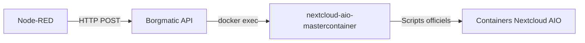

# Borgmatic API for Nextcloud AIO

🚀 **API REST pour piloter Borgmatic depuis Node-RED** avec support complet de Nextcloud AIO.


## 🎯 Fonctionnalités

- ✅ **API REST complète** : Créer, lister, extraire, monter des archives Borg
- ✅ **Intégration Nextcloud AIO** : Workflow complet (stop, backup, updates, healthcheck)
- ✅ **Compatibilité backup officiel** : Arrêt automatique de `daily-backup.sh` avant `borgmatic`
- ✅ **SSE (Server-Sent Events)** : Suivi temps réel des backups
- ✅ **Authentification bidirectionnelle** : Token + header custom
- ✅ **Rate limiting** : Protection contre abus
- ✅ **Docker-ready** : Mises à jour automatiques via Watchtower
- ✅ **SSH key management** : Création, rotation, test des clés
- ✅ **Emergency mode** : Arrêt d'urgence et gestion des locks

## 📦 Installation rapide

### 1. Prérequis

- Docker + Docker Compose
- Docker Socket Proxy (recommandé) ou accès restreint au socket Docker
- Borgmatic configuré (`/etc/borgmatic.d/*.yaml`)
- Nextcloud AIO running
- Clés SSH pour accès dépôt distant (optionnel)

### 2. Déploiement
```bash
# Cloner le repo
git clone https://github.com/quentinreytinas/borgmatic-api-nextcloud-aio.git
cd borgmatic-api-nextcloud-aio
```

### Copier et adapter la config
```bash
cp docker-compose.example.yml docker-compose.yml
```

### Générer un token fort
```bash
openssl rand -hex 32
```

> ℹ️ **Obligatoire** : `API_TOKEN` et `API_READ_TOKEN` doivent être définis (valeurs non vides). L'API refuse de démarrer si l'un des deux est manquant.

### Éditer docker-compose.yml et remplacer:
### - API_TOKEN=CHANGEME_... par votre token
### - Les chemins volumes à votre configuration
```bash
nano docker-compose.yml
```

> 🛡️ **Conseil sécurité** : utilisez le service `docker-socket-proxy` fourni dans l'exemple et définissez `DOCKER_HOST=tcp://docker-socket-proxy:2375` plutôt que de monter directement `/var/run/docker.sock`.

### Lancer
```bash
docker compose up -d
```
### Vérifier
```bash
curl -H "Authorization: Bearer VOTRE_TOKEN" \
     -H "X-From-NodeRed: NodeRED-Internal" \
     http://localhost:5000/health
```

Exemple : Créer un backup

```bash
curl -X POST http://borgmatic-api:5000/create-backup \
  -H "Authorization: Bearer VOTRE_TOKEN" \
  -H "X-From-NodeRed: NodeRED-Internal" \
  -H "Content-Type: application/json" \
  -d '{
    "repository": "prod",
    "borg_passphrase": "votre_passphrase_borg",
    "stats": true,
    "progress": true
  }'
```

Réponse :
json
```json

{
  "ok": true,
  "job_id": "create:1234567890",
  "pid": 42,
  "sse": "http://borgmatic-api:5000/events/stream?job_id=create:1234567890",
  "official_daily_stop": {
    "returncode": 0,
    "stdout": "Stopping daily-backup\n",
    "stderr": ""
  }
}
```

> ℹ️ Le champ `official_daily_stop` résume l'exécution de `docker exec nextcloud-aio-mastercontainer /daily-backup.sh stop`. Si
> l'arrêt est ignoré (valeurs par défaut absentes), l'objet contient `{"skipped": true, ...}`.

### Orchestration Nextcloud AIO depuis Node-RED



> ℹ️ **Socket proxy** : toutes les commandes `docker exec` émises par l'API
> honorent la variable d'environnement `DOCKER_HOST`. Définissez-la vers le
> service `docker-socket-proxy` (ex: `tcp://docker-socket-proxy:2375`) pour que
> chaque arrêt/démarrage passe par la proxy sécurisée.

**1. Forcer l'arrêt du script officiel**

```bash
curl -X POST http://borgmatic-api:5000/nextcloud/daily-backup/stop \
  -H "Authorization: Bearer VOTRE_TOKEN" \
  -H "X-From-NodeRed: NodeRED-Internal" \
  -H "Content-Type: application/json" \
  -d '{"timeout": 45}'
```

**2. Rejouer le workflow officiel (stop containers → backup → updates → restart)**

```bash
curl -X POST http://borgmatic-api:5000/nextcloud/daily-backup/run \
  -H "Authorization: Bearer VOTRE_TOKEN" \
  -H "X-From-NodeRed: NodeRED-Internal" \
  -H "Content-Type: application/json" \
  -d '{
        "with_stop": true,
        "automatic_updates": true,
        "daily_backup": true,
        "check_backup": false,
        "stop_containers": true,
        "start_containers": true
      }'
```

La réponse contient `result.command`, `result.stdout/stderr`, et l'environnement injecté (`env`) pour audit.

**3. Vérifier la disponibilité réseau des conteneurs**

```bash
curl -X POST http://borgmatic-api:5000/nextcloud/ports/probe \
  -H "Authorization: Bearer VOTRE_TOKEN" \
  -H "X-From-NodeRed: NodeRED-Internal" \
  -H "Content-Type: application/json" \
  -d '{"ports": [80,8443,9000]}'
```

Les ports indiqués comme `online: true` correspondent aux services accessibles (apache, proxy, collabora, etc.).

### Suivi temps réel (SSE)

```javascript
// Node-RED ou JavaScript
const evtSource = new EventSource('http://borgmatic-api:5000/events/stream?job_id=create:1234567890');

evtSource.addEventListener('stdout', (e) => {
  console.log('Backup progress:', JSON.parse(e.data));
});

evtSource.addEventListener('stderr', (e) => {
  console.error('Backup error:', JSON.parse(e.data));
});
```

### 📈 Observabilité

- Endpoint JSON `GET /metrics` (auth lecture) exposant :
  - `uptime_seconds`
  - `requests_total`
  - `responses_ok`
  - Compteurs d'erreurs (`responses_error_<code>`)
  - `rate_limit_blocked`
- Logs de validation Docker (`[SECURITY] docker exec validated ...`) toujours envoyés sur stdout pour audit Watchtower/Stackdriver.

### 🔐 Sécurité
Authentification
Deux mécanismes obligatoires :

Header custom : X-From-NodeRed: VotreValeur
Bearer token : Authorization: Bearer VOTRE_TOKEN

### Générer un token fort
```bash
openssl rand -hex 32
```

### Secrets distincts
L'API refuse si borg_passphrase == ssh_passphrase (sécurité renforcée).
Rate limiting


📝 Licence
MIT License - voir LICENSE
🙏 Remerciements

Borgmatic - Outil de backup Borg
Nextcloud AIO - Nextcloud All-in-One
Flask - Framework web Python

/create-backup : 5 requêtes / 60s
/repositories/{label}/check : 10 requêtes / 60s
/emergency/* : 2 requêtes / 600s

## 🧪 Développement

```bash
python -m venv .venv
source .venv/bin/activate
pip install -r requirements-dev.txt

# Formatage & lint
black --check .
ruff check .

# Tests unitaires
pytest
```
