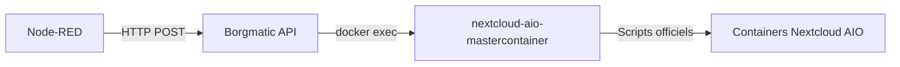

# Borgmatic API for Nextcloud AIO

🚀 **API REST pour piloter le backup officiel Nextcloud AIO** avec mode policy-based sécurisé et intégration Node-RED.

---

## 🎯 Fonctionnalités

- ✅ **API REST complète** : Créer, lister, extraire, monter des archives Borg
- ✅ **Intégration Nextcloud AIO** : Workflow officiel complet via `daily-backup.sh`
- ✅ **Une seule vérité backup** : les actions Node-RED passent par Nextcloud AIO, qui conserve son statut et ses notifications
- ✅ **SSE (Server-Sent Events)** : Suivi temps réel des backups
- ✅ **Rate limiting** : Protection contre abus
- ✅ **Docker-ready** : Mises à jour automatiques via Watchtower
- ✅ **SSH key management** : Création, rotation, test des clés
- ✅ **Emergency mode** : Arrêt d'urgence et gestion des locks
- ✅ **Multi-architecture** : Images `linux/amd64` + `linux/arm64/v8`

### 🔒 Sécurité avancée (nouveau)

- ✅ **Tokens 3 rôles** : ADMIN / ACTION / READ — séparation des privilèges
- ✅ **Policy-based actions** : Actions prédéfinies en YAML, Node-RED ne peut que déclencher
- ✅ **Flags sécurité** : 5 `ENABLE_*` pour isoler les endpoints sensibles
- ✅ **Audit logging** : JSON structuré (stdout + fichier) pour chaque action

---

## 🔒 Security Hardening

L'API utilise un modèle de sécurité à 3 rôles pour isoler Node-RED et réduire la surface d'attaque.

### Tokens 3 rôles

| Token | Rôle | Accès |
|-------|------|-------|
| `API_ADMIN_TOKEN` | Admin | Accès complet (config, locks, passphrase, actions) |
| `API_ACTION_TOKEN` | Action | Actions prédéfinies uniquement (pour Node-RED) |
| `API_READ_TOKEN` | Read | Statut, health, polling jobs, logs |

Configuration :

```env
SECURE_MODE=true
API_ADMIN_TOKEN=<token admin>
API_ACTION_TOKEN=<token action pour Node-RED>
API_READ_TOKEN=<token lecture>
```

En mode sécurisé (`SECURE_MODE=true`), les 3 tokens sont obligatoires.

### Flags de sécurité

5 drapeaux pour contrôler finement les endpoints sensibles :

```env
ENABLE_ADMIN_ENDPOINTS=true    # /emergency/shutdown
ENABLE_CONFIG_WRITE=true       # /configs/* PUT/DELETE, /nextcloud/backup-target POST
ENABLE_BREAK_LOCK=true         # /borgmatic-locks/break/*
ENABLE_PASSPHRASE_CHANGE=true  # /repositories/*/passphrase/change
ENABLE_ARBITRARY_TARGETS=true  # /nextcloud/daily-backup/run-for-target*
```

Désactivez les flags inutiles pour réduire la surface d'attaque, même avec un token ADMIN.

### Surface d'attaque si Node-RED est compromis

Avec `API_ACTION_TOKEN` + policy-based actions :

| Action | Possible ? |
|--------|------------|
| Déclencher la sauvegarde prédéfinie | ✅ Oui |
| Changer la cible de backup | ❌ Non |
| Casser un Borg lock | ❌ Non |
| Changer la passphrase | ❌ Non |
| Modifier une configuration | ❌ Non |
| Emergency shutdown | ❌ Non |
| Envoyer un payload arbitraire | ❌ Non |

---

## 📦 Installation rapide

### 1. Prérequis

- Docker + Docker Compose
- Docker Socket Proxy (recommandé) ou accès restreint au socket Docker
- Borgmatic configuré (`/etc/borgmatic.d/*.yaml`)
- Nextcloud AIO running
- Clés SSH pour accès dépôt distant (optionnel)

### 2. Déploiement

```bash
# Cloner le repo
git clone https://github.com/quentinreytinas/borgmatic-api-nextcloud-aio.git
cd borgmatic-api-nextcloud-aio

# Copier et adapter la config
cp docker-compose.example.yml docker-compose.yml
```

### 3. Générer les tokens

```bash
openssl rand -hex 32  # API_ADMIN_TOKEN
openssl rand -hex 32  # API_ACTION_TOKEN
openssl rand -hex 32  # API_READ_TOKEN
```

### 4. Configurer

Éditez `docker-compose.yml` et remplacez :

- Les tokens (`API_ADMIN_TOKEN` / `API_ACTION_TOKEN` / `API_READ_TOKEN`)
- Les chemins volumes à votre configuration
- `ACTIONS_POLICY_PATH` pour les actions prédéfinies

> 🛡️ **Conseil sécurité** : utilisez le service `docker-socket-proxy` fourni dans l'exemple et définissez `DOCKER_HOST=tcp://docker-socket-proxy:2375` plutôt que de monter directement `/var/run/docker.sock`.

### 5. Lancer

```bash
docker compose up -d
```

### 6. Vérifier

```bash
curl -H "Authorization: Bearer VOTRE_TOKEN" \
     http://localhost:5000/health/public
```

---

## ⚡ Policy-Based Actions

Le mode policy-based permet de définir des actions de sauvegarde Nextcloud AIO prédéfinies dans un fichier YAML. Node-RED ne peut alors que déclencher ces actions — il ne peut pas modifier les paramètres.

Les actions policy lancent uniquement le workflow officiel Nextcloud AIO : l'API change temporairement la cible, exécute `/daily-backup.sh`, streame les événements, puis restaure la cible précédente. Le statut "Last backup successful/failed" et les notifications restent donc gérés par Nextcloud AIO.

### Configuration

Créez un fichier `actions-policy.yaml` (voir `actions-policy.example.yaml`) :

```yaml
allowed_actions:
  nextcloud-backup-example:
    type: nextcloud_aio_backup
    remote_repo: ssh://backup_user@example.org:22//path/to/nextcloud/borg
    restore_after: true
    daily_backup: true
    check_backup: false
    stop_containers: true
    start_containers: true
    automatic_updates: false
    stop_timeout: 60
    timeout: 21600
```

Montez le fichier dans le conteneur :

```yaml
volumes:
  - ./actions-policy.yaml:/app/actions-policy.yaml:ro
environment:
  ACTIONS_POLICY_PATH: /app/actions-policy.yaml
```

### Utilisation

Node-RED appelle simplement :

```bash
curl -X POST http://borgmatic-api:5000/actions/nextcloud-backup-example/run \
  -H "Authorization: Bearer ${API_ACTION_TOKEN}"
```

Aucun payload requis. Tous les paramètres (cible locale ou dépôt distant, timeout, arrêt/redémarrage des conteneurs, etc.) sont déterminés côté API à partir de la policy. Le code ne contient pas de noms de dépôts réels : les cibles viennent uniquement de `actions-policy.yaml`.

### Réponse

```json
{
  "job_id": "9f9ff4b8-7ed5-4f0a-99dd-2c329fc79f8e",
  "action": "nextcloud-backup-example",
  "status": "queued",
  "message": "Action 'nextcloud-backup-example' triggered successfully"
}
```

Les credentials dans `target_display` sont masqués automatiquement.

### Endpoints actions

| Endpoint | Méthode | Rôle | Description |
|----------|---------|------|-------------|
| `/actions` | GET | ACTION+ | Lister les actions (champs sûrs) |
| `/actions/{name}/run` | POST | ACTION+ | Déclencher une action (async) |

---

## 🔑 Tokens & Authentification

```env
SECURE_MODE=true
API_ADMIN_TOKEN=<token fort>
API_ACTION_TOKEN=<token fort>
API_READ_TOKEN=<token fort>
```

- **Node-RED** reçoit uniquement `API_ACTION_TOKEN` (+ `API_READ_TOKEN` pour le polling SSE)
- **Admin** utilise `API_ADMIN_TOKEN` pour les opérations sensibles

---

## 📡 API Endpoints

### Health

| Endpoint | Méthode | Auth | Description |
|----------|---------|------|-------------|
| `/health/public` | GET | Aucune | Healthcheck public |
| `/health` | GET | Read+ | Healthcheck + version |

### Repositories

| Endpoint | Méthode | Auth | Description |
|----------|---------|------|-------------|
| `/repositories` | GET | Read+ | Lister les dépôts |
| `/repositories/{label}/info` | GET | Read+ | Infos dépôt |
| `/repositories/{label}/check` | POST | Write+ | Vérifier un dépôt |
| `/repositories/{label}/compact` | POST | Write+ | Compacter un dépôt |
| `/repositories/{label}/passphrase/change` | POST | Admin+ | Changer passphrase |

### Backups

| Endpoint | Méthode | Auth | Description |
|----------|---------|------|-------------|
| `/create-backup` | POST | Write+ | Créer un backup |
| `/list-archives` | GET | Read+ | Lister les archives |
| `/extract-archive` | POST | Write+ | Extraire une archive |
| `/mount-archive` | POST | Write+ | Monter une archive |

### Borgmatic Configs

| Endpoint | Méthode | Auth | Description |
|----------|---------|------|-------------|
| `/configs` | GET | Read+ | Lister les configs |
| `/configs/{name}` | GET | Read+ | Lire une config |
| `/configs/{name}` | PUT | Admin+ | Créer/mettre à jour |
| `/configs/{name}` | DELETE | Admin+ | Supprimer |

### SSH Keys

| Endpoint | Méthode | Auth | Description |
|----------|---------|------|-------------|
| `/ssh/keys` | GET | Read+ | Lister les clés |
| `/ssh/keys/generate` | POST | Admin+ | Générer une clé |
| `/ssh/keys/{name}/test` | POST | Write+ | Tester une connexion |

### Emergency

| Endpoint | Méthode | Auth | Description |
|----------|---------|------|-------------|
| `/emergency/shutdown` | POST | Admin+ | Arrêt d'urgence |
| `/borgmatic-locks` | GET | Read+ | Lister les locks |
| `/borgmatic-locks/break/{label}` | POST | Admin+ | Casser un lock |

### Nextcloud AIO

| Endpoint | Méthode | Auth | Description |
|----------|---------|------|-------------|
| `/nextcloud/daily-backup/stop` | POST | Write+ | Arrêter le backup officiel |
| `/nextcloud/daily-backup/run` | POST | Write+ | Lancer le workflow officiel |
| `/nextcloud/daily-backup/run/async` | POST | Write+ | Workflow officiel (async) |
| `/nextcloud/daily-backup/run-for-target` | POST | Write+ | Backup avec cible temporaire |
| `/nextcloud/daily-backup/run-for-target/async` | POST | Write+ | Backup cible temporaire (async) |
| `/nextcloud/backup-target` | GET | Read+ | Lire la cible actuelle |
| `/nextcloud/backup-target` | POST | Admin+ | Changer la cible |
| `/nextcloud/ports/probe` | POST | Write+ | Tester la disponibilité réseau |

### Policy-Based Actions

| Endpoint | Méthode | Auth | Description |
|----------|---------|------|-------------|
| `/actions` | GET | ACTION+ | Lister les actions |
| `/actions/{name}/run` | POST | ACTION+ | Déclencher une action |

### Observabilité

| Endpoint | Méthode | Auth | Description |
|----------|---------|------|-------------|
| `/metrics` | GET | Read+ | Métriques JSON |
| `/openapi.yaml` | GET | Aucune | OpenAPI spec |
| `/events/stream?job_id=` | GET | Read+ | SSE events |

> **Niveaux d'accès** : Read < Write < Admin < ACTION (ACTION ≥ Read pour les actions).
> Les flags `ENABLE_*` peuvent restreindre certains endpoints même avec un token ADMIN.

---

## 📊 Audit & Observabilité

### Audit logging

En mode policy-based, chaque action génère des entrées JSON structurées :

```json
{"event":"action_start","timestamp":"2026-04-30T10:00:00Z","action_name":"nextcloud-backup-example","source_ip":"192.168.1.50","token_role":"action","job_id":"9f9ff4b8-7ed5-4f0a-99dd-2c329fc79f8e","target_repo":"ssh://backup_user@***:22//path/to/nextcloud/borg"}
{"event":"action_complete","job_id":"9f9ff4b8-7ed5-4f0a-99dd-2c329fc79f8e","exit_code":0,"duration_sec":342.5}
```

Configuration :

```env
AUDIT_LOG_PATH=/var/log/borgmatic-api/audit.jsonl  # Fichier (optionnel)
AUDIT_STDOUT=true                                   # stdout (optionnel)
```

### Métriques

```bash
curl -H "Authorization: Bearer ${API_READ_TOKEN}" \
     http://localhost:5000/metrics
```

Réponse :

```json
{
  "uptime_seconds": 86400,
  "requests_total": 1523,
  "responses_ok": 1490,
  "responses_error_500": 12,
  "rate_limit_blocked": 21
}
```

### Suivi temps réel (SSE)

```javascript
const evtSource = new EventSource(
  'http://borgmatic-api:5000/events/stream?job_id=create:1234567890',
  { headers: { 'Authorization': `Bearer ${API_READ_TOKEN}` } }
);

evtSource.addEventListener('stdout', (e) => {
  console.log('Backup progress:', JSON.parse(e.data));
});

evtSource.addEventListener('stderr', (e) => {
  console.error('Backup error:', JSON.parse(e.data));
});
```

---

## 📝 Exemples d'utilisation

### Créer un backup

```bash
curl -X POST http://borgmatic-api:5000/create-backup \
  -H "Authorization: Bearer ${API_ADMIN_TOKEN}" \
  -H "Content-Type: application/json" \
  -d '{
    "repository": "prod",
    "borg_passphrase": "votre_passphrase_borg",
    "stats": true,
    "progress": true
  }'
```

Réponse :

```json
{
  "ok": true,
  "job_id": "create:1234567890",
  "pid": 42,
  "sse": "http://borgmatic-api:5000/events/stream?job_id=create:1234567890",
  "official_daily_stop": {
    "returncode": 0,
    "stdout": "Stopping daily-backup\n",
    "stderr": ""
  }
}
```

> ℹ️ Le champ `official_daily_stop` résume l'exécution de `docker exec nextcloud-aio-mastercontainer /daily-backup.sh stop`. Si l'arrêt est ignoré (valeurs par défaut absentes), l'objet contient `{"skipped": true, ...}`.

### Workflow Nextcloud AIO complet

```bash
curl -X POST http://borgmatic-api:5000/nextcloud/daily-backup/run \
  -H "Authorization: Bearer ${API_ADMIN_TOKEN}" \
  -H "Content-Type: application/json" \
  -d '{
    "with_stop": true,
    "automatic_updates": true,
    "daily_backup": true,
    "check_backup": false,
    "stop_containers": true,
    "start_containers": true
  }'
```

La réponse contient `result.command`, `result.stdout/stderr`, et l'environnement injecté (`env`) pour audit. Si le script officiel retourne `0` mais que le conteneur `nextcloud-aio-borgbackup` échoue ensuite, l'API répond en erreur avec `error=backup_failed` et inclut la fin des logs Borg.

### Backup avec cible temporaire

```bash
curl -X POST http://borgmatic-api:5000/nextcloud/daily-backup/run-for-target \
  -H "Authorization: Bearer ${API_ADMIN_TOKEN}" \
  -H "Content-Type: application/json" \
  -d '{
    "remote_repo": "ssh://user@host:22/path/to/borg",
    "restore_after": true,
    "daily_backup": true,
    "stop_containers": true,
    "start_containers": true,
    "automatic_updates": false
  }'
```

> 💡 Pour une meilleure sécurité, utilisez `POST /actions/{name}/run` avec une action prédéfinie afin d'éviter d'envoyer la cible dans le payload.

### Architecture Node-RED → Borgmatic API


```mermaid
flowchart LR
    NR[Node-RED] -->|HTTP POST| API[Borgmatic API]
    API -->|docker exec| MC[nextcloud-aio-mastercontainer]
    MC -->|Scripts officiels| Stack[Containers Nextcloud AIO]
```

> ℹ️ **Socket proxy** : toutes les commandes `docker exec` émises par l'API honorent la variable d'environnement `DOCKER_HOST`. Définissez-la vers le service `docker-socket-proxy` (ex: `tcp://docker-socket-proxy:2375`) pour que chaque arrêt/démarrage passe par la proxy sécurisée.

---

## 🧪 Développement

```bash
python -m venv .venv
source .venv/bin/activate
pip install -r requirements-dev.txt

# Formatage & lint
black --check .
ruff check .

# Tests unitaires
pytest

# Tests avec variables d'environnement
API_ADMIN_TOKEN=test-admin API_ACTION_TOKEN=test-action API_READ_TOKEN=test-read pytest -v
```

### CI

La CI (GitHub Actions) exécute automatiquement :
- Lint : `ruff check .`
- Format : `black --check .`
- Tests : `pytest -v`

---

## 📝 Licence

MIT License — voir [LICENSE](LICENSE)

## 🙏 Remerciements

- [Borgmatic](https://github.com/borgmatic-collective/borgmatic) — Outil de backup Borg
- [Nextcloud AIO](https://github.com/nextcloud/all-in-one) — Nextcloud All-in-One
- [Flask](https://flask.palletsprojects.com/) — Framework web Python
